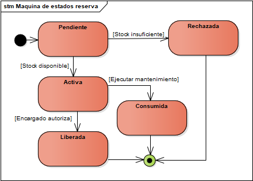
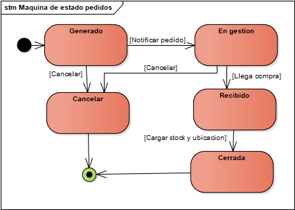

# M1 - Documentación funcional

## 1. Introducción y alcance

El sistema tiene como objetivo gestionar el stock de repuestos e insumos de una planta farmacéutica y vincularlo con los procesos de mantenimiento, incidencias, reparaciones, reservas y pedidos de compra.

La solución debe permitir trazabilidad de los movimientos, identificación por QR o código de barras, alertas de umbral mínimo, notificaciones y acceso desde celular y PC.

## 2. Máquinas de estado

### 2.1 Incidencia

### 2.2 Reserva

### 2.3 Pedido

