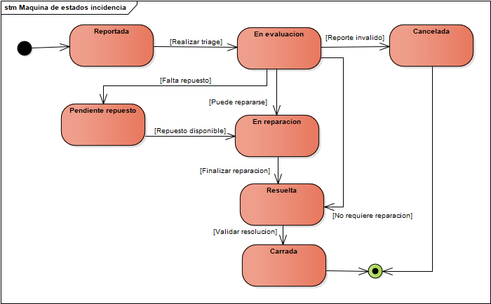
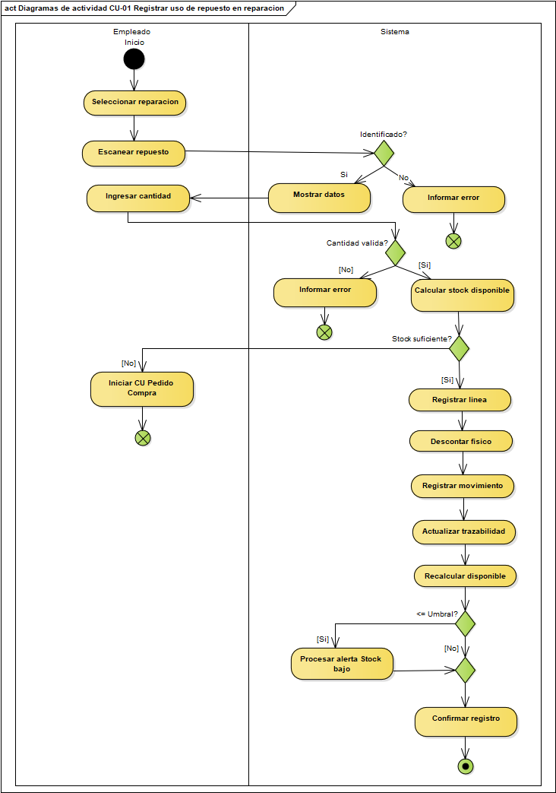
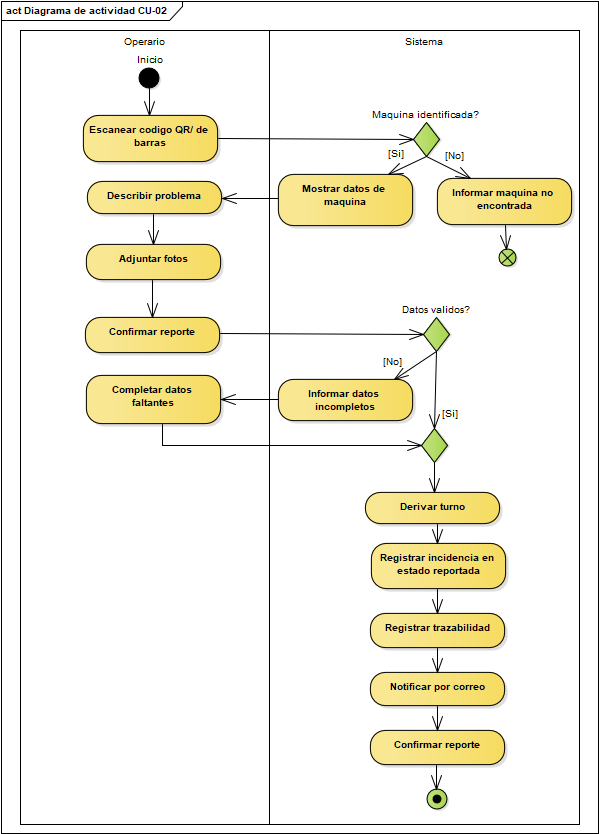
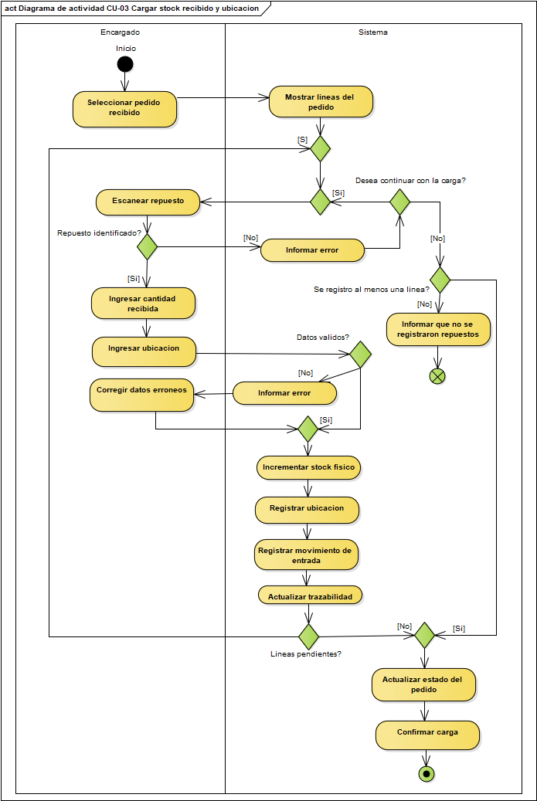
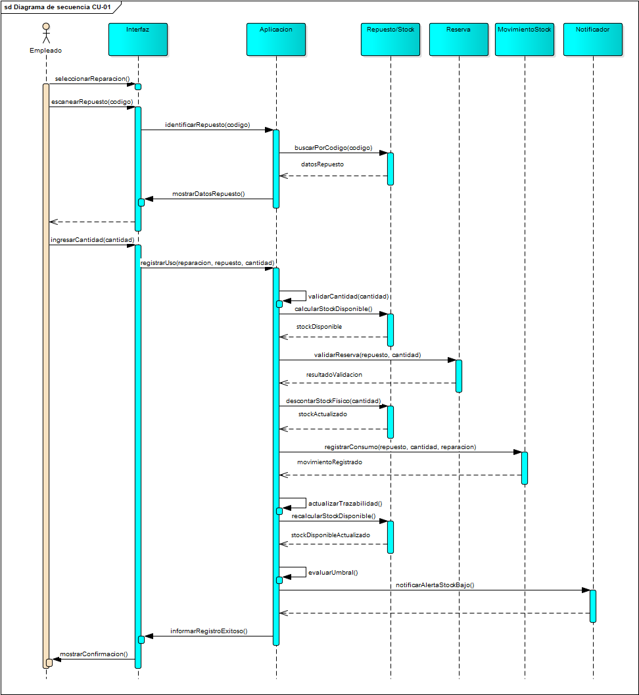
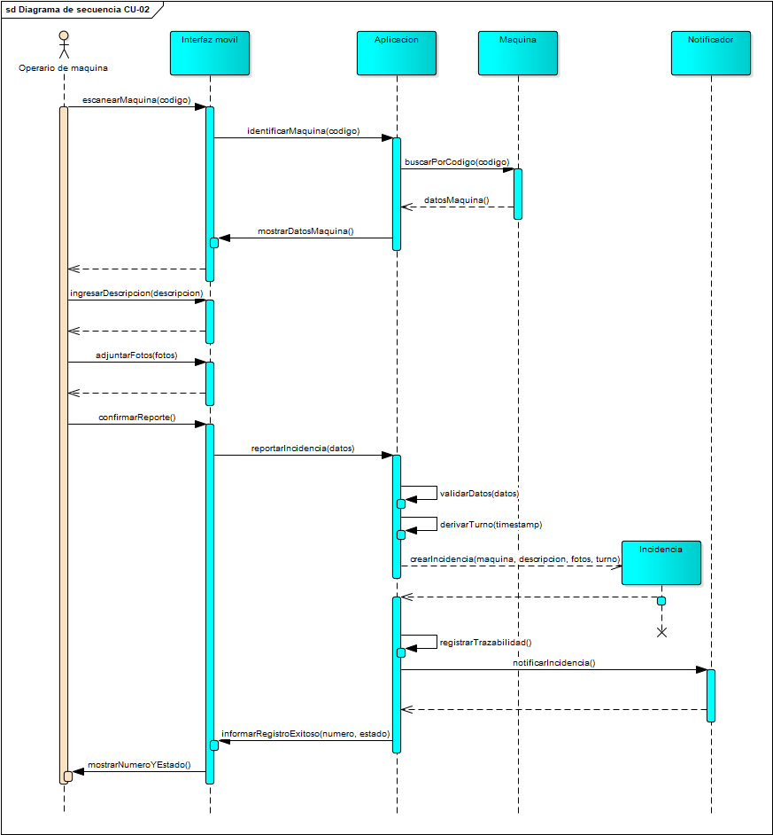
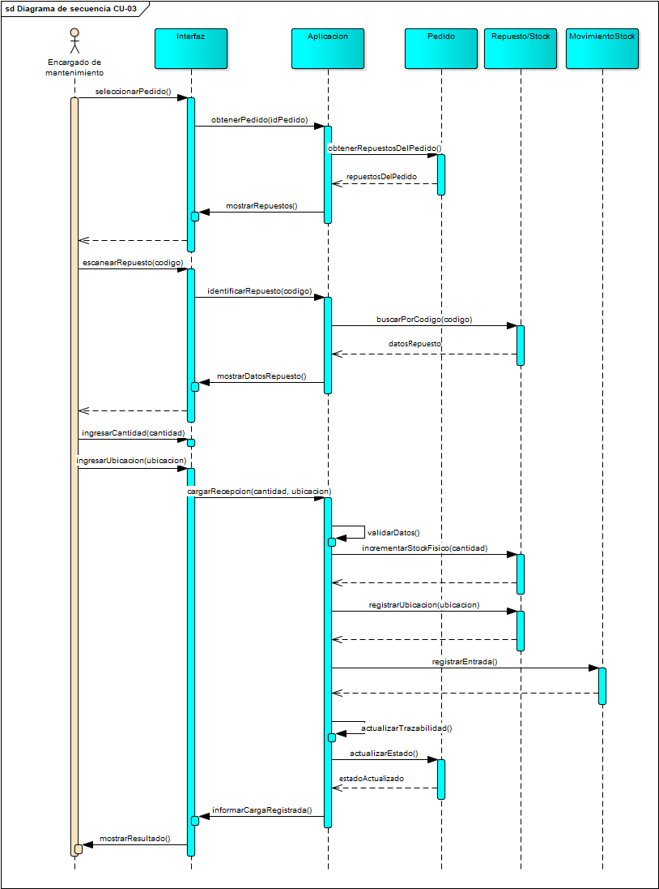

# M1 - Documentación funcional

## 1. Introducción y alcance

El sistema tiene como objetivo gestionar el stock de repuestos e insumos de una planta farmacéutica y vincularlo con los procesos de mantenimiento, incidencias, reparaciones, reservas y pedidos de compra.

La solución debe permitir trazabilidad de los movimientos, identificación por QR o código de barras, alertas de umbral mínimo, notificaciones y acceso desde celular y PC.

## 2. Máquinas de estado

### 2.1 Incidencia

### 2.2 Reserva

### 2.3 Pedido

## 3. CU-01 - Registrar uso de repuesto
### CU-01 - Registrar uso de repuesto en una reparación
#### Identificación:
- Nombre: Registrar uso de repuesto en una reparación
- Actor principal: Empleado de mantenimiento
- Objetivo: Registrar los repuestos utilizar durante una operación y actualizar automáticamente el stock correspondiente
- Disparador: El empleado de mantenimiento utiliza uno o más repuestos durante una reparación y escanea el código QR o de barras del repuesto

#### Reglas de negocio relacionadas:
- **RN-01 — Descuento por uso.** Usar un repuesto en una reparación descuenta del **stock físico** la cantidad de la línea de uso (entera ≥ 1). El stock físico resultante debe ser **≥ 0**: si no alcanza, el uso se rechaza.
- **RN-02 — Umbral.** Cada repuesto tiene un `umbral mínimo`. Cuándo `stock disponible ≤ umbral mínimo`, se genera una **alerta** y el repuesto aparece en la **lista de compras**.
- **RN-03 — Faltante → compra.** Si no hay **stock disponible** para una solicitud, el empleado lo reporta y puede **generar un pedido de compra**.
- **RN-05 — Reserva.** Un repuesto **reservado** no se usa en otra incidencia. La liberación exige **autorización de un usuario con rol Encargado** y **aviso inmediato** del cambio y su impacto sobre lo planificado.
- **RN-06 — Trazabilidad.** De cada repuesto se reconstruye su historia **interna**: pedido de compra → recepción (RN-08) → uso. *La logística externa con proveedores queda fuera del alcance* (sección 7).
- **RN-09 — Notificación por correo.** Se notifican por correo: **incidentes, cambios de parte, solicitudes de compra, informes de resolución y alertas de umbral**. *(Implementación vía puerto de notificación con adaptador falso por defecto, sección 7.)*

#### Precondiciones
- El empleado de mantenimiento se encuentra autenticado y posee permisos para registrar el uso de repuestos. 
- La reparación se encuentra identificada. 
- El repuesto se encuentra registrado en el sistema. 
- La cantidad a utilizar es un número entero mayor o igual a 1. 
- Las unidades que se utilizarán no deben corresponder a una reserva activa para otro mantenimiento, salvo autorización de un Encargado.

#### Escenario principal:  
- El empleado de mantenimiento selecciona la reparación sobre la cual está trabajando. 
- El empleado escanea el código QR o de barras del repuesto utilizado. 
- El sistema identifica el repuesto. 
- El empleado indica la cantidad de unidades utilizadas. 
- El sistema valida que la cantidad sea mayor o igual a 1.
- El sistema verifica que exista stock suficiente para registrar el uso y que no se estén utilizando unidades reservadas para otro mantenimiento. 
- El sistema registra una línea de uso asociando el repuesto, la cantidad y la reparación. 
El sistema descuenta del stock físico la cantidad utilizada. 
- El sistema registra el movimiento de stock correspondiente para conservar la trazabilidad. 
- El sistema recalcula el stock disponible.
- El sistema verifica si el stock disponible es menor o igual al umbral mínimo del repuesto. 
- El sistema confirma al empleado que el uso del repuesto fue registrado correctamente. 

#### Postcondiciones
- La línea de uso queda asociada a la reparación. 
- El stock físico del repuesto queda actualizado. 
- El movimiento de stock queda registrado. 
- La utilización del repuesto queda incorporada a su historial de trazabilidad. 
- Si el stock disponible quedó en el umbral mínimo o por debajo, se genera la alerta correspondiente y el repuesto aparece en la lista de compras.

#### Escenario alternativo: el stock alcanza el umbral mínimo
- El sistema genera una alerta de stock bajo.
- El repuesto pasa a formar parte de la lista de compras
- El sistema genera la notificación correspondiente.
- El caso de uso continúa normalmente y se informa que el uso quedó registrado.

#### Se aplican RN-02 y RN-09:
- **RN-02 — Umbral.** Cada repuesto tiene un umbral mínimo. Cuándo stock disponible ≤ umbral mínimo, se genera una **alerta** y el repuesto aparece en la **lista de compras**.
- **RN-09 — Notificación por correo.** Se notifican por correo: **incidentes, cambios de parte, solicitudes de compra, informes de resolución y alertas de umbral**. *(Implementación vía puerto de notificación con adaptador falso por defecto, sección 7.)*

#### Escenario alternativo: existen unidades reservadas
- El sistema no permite utilizar las unidades reservadas en otra incidencia. 
- Si un Encargado autoriza su liberación, se registra la autorización. 
- El sistema libera la reserva correspondiente. 
- Se notifica inmediatamente el cambio y su impacto sobre el mantenimiento planificado. 
- El caso de uso continúa desde la validación de stock. 

#### Se aplica RN-05:
- **RN-05 — Reserva.** Un repuesto **reservado** no se usa en otra incidencia. La liberación exige **autorización de un usuario con rol Encargado** y **aviso inmediato** del cambio y su impacto sobre lo planificado.

#### Excepción: stock insuficiente
- El sistema rechaza el uso del repuesto. 
- El stock físico no se modifica. 
- No se registra la línea de uso. 
- El sistema informa al empleado que no existe stock suficiente. 
- El empleado puede reportar el faltante y generar un pedido de compra. 

#### Se aplica RN-01 y RN-03
- **RN-01 — Descuento por uso.** Usar un repuesto en una reparación descuenta del **stock físico** la cantidad de la línea de uso (entera ≥ 1). El stock físico resultante debe ser **≥ 0**: si no alcanza, el uso se rechaza.
- **RN-03 — Faltante → compra.** Si no hay **stock disponible** para una solicitud, el empleado lo reporta y puede **generar un pedido de compra**.

### Diagrama de actividad CU 01: registrar uso de repuesto

### Diagrama de actividad CU 02: Reportar incidencia

### Diagrama de actividad CU 03: cargar stock recibido y ubicacion

### Diagrama de secuencia CU 01 

### Diagrama de secuencia CU 02

### Diagrama de secuencia CU 03

