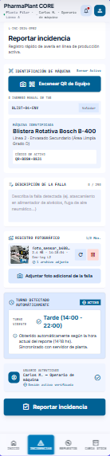
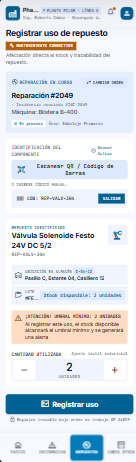
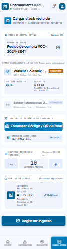

# M2 — Contrato + esqueleto desplegado

## Objetivo

La M2 tiene como objetivo presentar un primer recorte ejecutable del Sistema de Gestión de Stock y Mantenimiento de Planta.

La entrega incluye:

- prototipo visual recortado a 3 pantallas funcionales;
- contrato OpenAPI v0;
- esqueleto del proyecto preparado para ejecutarse mediante Docker Compose.

## Prototipo

El prototipo fue diseñado con enfoque mobile-first, dado que los operarios y el personal de mantenimiento utilizan el sistema principalmente desde dispositivos móviles.

Las tres pantallas seleccionadas representan las funcionalidades principales del alcance del equipo.

### 1. Reportar incidencia

**Actor principal:** Operario de máquina.

Permite identificar una máquina mediante código QR o ingreso manual, describir el problema observado y adjuntar fotografías.

El turno se obtiene automáticamente a partir del momento del reporte.



### 2. Registrar uso de repuesto

**Actor principal:** Empleado de mantenimiento.

Permite seleccionar una reparación en curso, identificar el repuesto utilizado mediante su código, indicar la cantidad consumida y consultar su stock disponible y ubicación.

Si luego del uso el stock disponible alcanza o queda por debajo del umbral mínimo, el sistema genera la alerta correspondiente.



### 3. Cargar stock recibido

**Actor principal:** Encargado de mantenimiento.

Permite seleccionar un pedido de compra, identificar el repuesto recibido, registrar la cantidad ingresada y establecer su ubicación dentro del almacén.



## Prototipo interactivo complementario

Además de las tres pantallas principales de M2, se diseñaron vistas complementarias para representar la navegación general del producto:

- inicio de sesión;
- menú principal;
- acceso a funcionalidades según el rol del usuario;
- vista de notificaciones.

Estas pantallas complementan la demostración visual del sistema, pero las tres funcionalidades detalladas anteriormente constituyen el recorte principal de la M2.

## Contrato OpenAPI v0

El contrato inicial de la API se encuentra en:

`docs/spec/openapi.yaml`

Está definido utilizando **OpenAPI 3.1.0** y contempla las operaciones necesarias para soportar las tres pantallas principales del prototipo.

Entre las operaciones incluidas se encuentran:

- consulta de máquinas;
- registro de incidencias;
- consulta de repuestos;
- consulta de reparaciones;
- registro del uso de repuestos;
- consulta de pedidos de compra;
- registro de recepción de stock.

El contrato puede utilizarse con Prism para generar un servidor mock y permitir que el frontend pueda desarrollarse contra la API antes de que exista el backend definitivo.

## Ejecutar el mock con Prism

Desde la raíz del repositorio:

```bash
prism mock docs/spec/openapi.yaml
```

Por defecto, Prism expone el mock en:

`http://127.0.0.1:4010`

## Despliegue

La M2 incluye un esqueleto reproducible mediante Docker Compose.

Desde la raíz del repositorio:

```bash
docker compose up
```

La configuración permite levantar el entorno inicial del proyecto y será extendida en las siguientes muestras a medida que se incorporen frontend, backend y base de datos.

## Relación con las próximas muestras

El contrato OpenAPI definido en M2 será utilizado en M3 para que la SPA React + TypeScript consuma el mock generado con Prism.

Posteriormente, el backend implementará el mismo contrato, permitiendo que frontend y backend evolucionen sobre una interfaz previamente acordada.