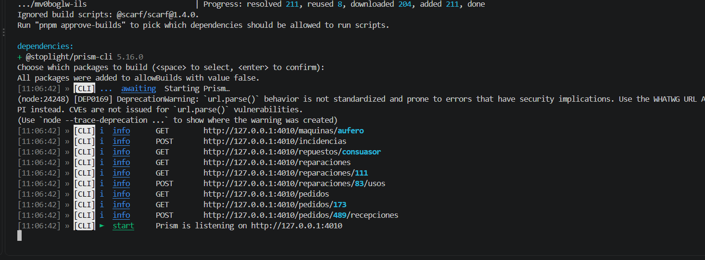
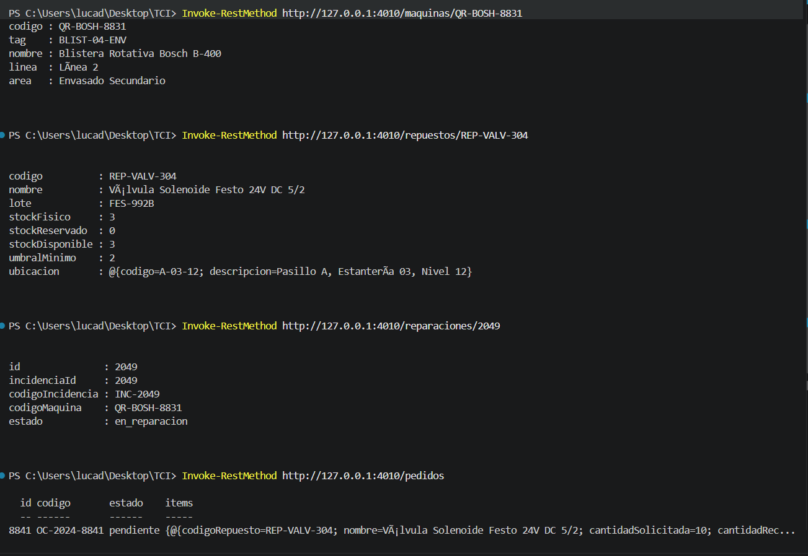

# Evidencias de prueba — M2

## Contrato OpenAPI y servidor mock

Se utilizó Prism para validar y ejecutar el contrato OpenAPI ubicado en:

`docs/spec/openapi.yaml`

El servidor mock se inició desde la raíz del repositorio mediante:

```bash
pnpm dlx @stoplight/prism-cli mock docs/spec/openapi.yaml
```

Prism inició correctamente y dejó disponible el servicio en:

`http://127.0.0.1:4010`

### Evidencia



---

## Pruebas de consulta

Con el servidor mock en ejecución se realizaron consultas sobre distintos recursos definidos en el contrato OpenAPI.

### Máquina

```http
GET /maquinas/QR-BOSH-8831
```

Se obtuvo correctamente la información correspondiente a la máquina identificada.

### Repuesto

```http
GET /repuestos/REP-VALV-304
```

Se obtuvo correctamente la información del repuesto, incluyendo stock, umbral mínimo y ubicación.

### Reparación

```http
GET /reparaciones/2049
```

Se obtuvo correctamente la información de la reparación, incluyendo la incidencia asociada, la máquina y su estado.

### Pedidos de compra

```http
GET /pedidos
```

Se obtuvo correctamente el listado de pedidos de compra definido en el contrato.

### Evidencia



---

## Resultado

El contrato OpenAPI pudo ser interpretado correctamente por Prism y el servidor mock respondió satisfactoriamente las operaciones de consulta probadas.

Esto permite utilizar el contrato como base para el desarrollo posterior del frontend y del backend.