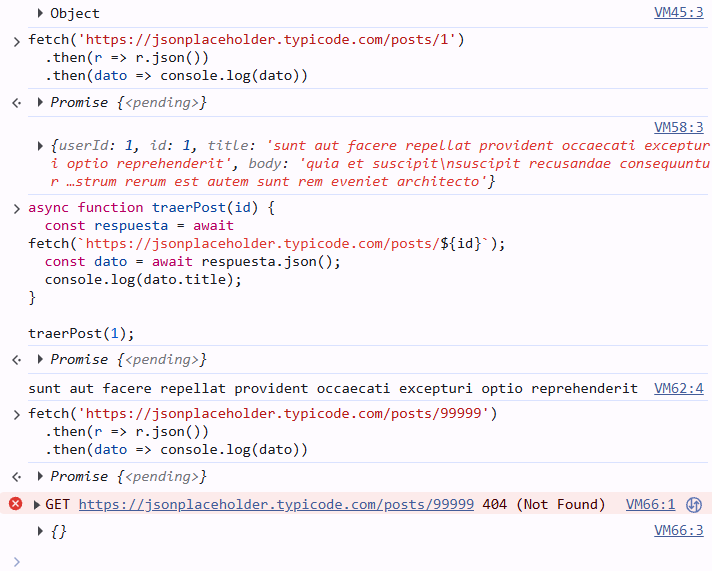
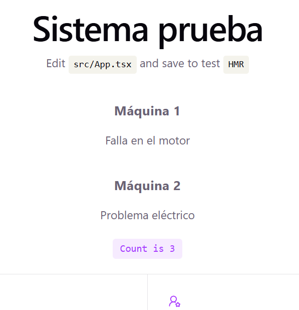
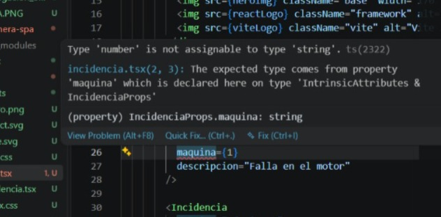

# Investigación — [Nosetti, Maria Constanza] (Legajo 33136)

## Parte A — JS asincrónico + fetch + SPA
- Preguntas guía 1, 2, 3 (respuestas en MIS palabras)
- Búsquedas: qué busqué, qué fuente (URL), qué entendí
- Evidencia de la actividad guiada: captura/s de la consola
### Preguntas guia
#### ¿Qué significa que fetch sea asincrónico? ¿Qué pasaría con la página si no lo fuera?
- Que sea asincronico significa que puede seguir ejecutando otras tareas mientras espera la respuesta del fetch. Si no lo fuera, la pagina tendria que quedar a la espera de la respuesta para poder continuar con cualquier tarea.

#### ¿Por qué respuesta.json() también devuelve una promesa?
- Devuelve una promesa porque queda a la espera de leer y procesar el contenido para poder utilizarlo

#### ¿Qué relación hay entre una SPA y fetch? ¿Por qué la SPA "necesita" pedir datos así?
- Como el SPA trabaja sobre una sola pagina, necesita que en caso de quedar a la espera de algun proceso, la pagina no quede bloqueada y pueda seguir ejecutando distintas tareas y componentes. Fetch permite manejar los datos con el servidor de manera asincronica mientra la pagina sigue funcionando.

### Busqueda
#### ¿Qué es una SPA (Single Page Application) y en qué se diferencia de una página tradicional (MPA)?
- SPA: Single Page Applications, navega desde una sola pagina realizando todas las interaccionas necesarias usuario servidor
- MPA: Multi Page Application, utiliza multiples paginas HTML con contenidos diferentes para la navegacion
- (https://www.arquitecturajava.com/spa-vs-mpa-y-las-arquitecturas-web/) 

#### ¿Qué es una promesa (Promise) en JavaScript y para qué sirve? ¿Qué problema resuelve?
- Promesa: objeto que representa el resultado de una operacion que puede todavia no haber terminado de ejecutarse. Inicia en pendiente una vez que tiene el resultado puede ser una respuesta o un error. Se utiliza para codigo asincronico, con tareas que pueden tardar en dar un resultado. 
- (https://es.javascript.info/promise-basics)

#### ¿Por qué fetch devuelve una promesa y no el dato directamente?
- Fetch devuelve una promesa porque es una peticion que puede tardar en obtener la informacion solicitada y al devolver una promesa indica que queda a la espera de la resolucion de la misma
- (https://developer.mozilla.org/es/docs/Web/API/Fetch_API/Using_Fetch)

##### ¿Qué diferencia hay entre XMLHttpRequest (lo viejo) y fetch (lo actual)?
- XMLHttpRequest: utiliza eventos para manejar repuestas asincronicas. 
- fetch: utiliza promesas para manejar repuestas asincronicas. Es mas flexible y potente, soporta aspectos mas avanzados de HTTP
- (https://developer.mozilla.org/en-US/docs/Web/API/XMLHttpRequest_API)

### Evidencia actividad guiada
- 

## Parte B — React + TypeScript + Vite
- Preguntas guía 1, 2, 3
- Búsquedas
- Evidencia: captura del scaffold andando (localhost:5173) + captura de tu componente Incidencia + captura de un error de tipos
### Pregunta guía
#### ¿Qué relación ves entre el patrón "separar datos de la vista" que usaste en el taller de incidencia (clase del 14/09) y el estado de React?
- En el taller, los datos se guardaban en un objeto y luego una función los mostraba en la página. En React, el estado permite guardar los datos que el componente necesita recordar y el JSX permite mostrarlos en la interfaz.

#### ¿Por qué el interface IncidenciaProps evita errores? ¿Dónde "vive" esa verificación: en el navegador o en el editor?
- Porque define los datos que debe recibir el componente y que tipo denen ser, al realizar la verificacion durante el desarrollo el error se muestra en la terminal antes de que llegue a ser un error durante en funcionamiento de la aplicacion.

#### ¿Qué hace Vite que antes hacías a mano (o con un script de <head>)?
-Vite permite actualizar los cambios en un proyecto automaticamente, sin necesitad de vincular manualmente JS con el HTML mediante una etiqueta en el script

### Búsqueda
#### ¿Qué es un componente en React? ¿Por qué conviene dividir la UI en componentes?
- Un componente React es una parte de la interfaz de usuario (UI) que tiene su propia logica y apariencia. Permite organizar la interfaz en partes mas pequeñas, donde cada componente cumple una funcion determinada y puede reutilizarse.
- (https://es.react.dev/learn)
- (https://es.react.dev/learn/thinking-in-react)

#### ¿Qué es JSX? ¿Por qué se parece a HTML pero no es HTML?
- JSX es una sintaxis de marcado opcional (permite escribir etiquetas y reglas para indicar la estructura del contenido) que se usa en la mayoria de los proyectos de React. No es HTML porque tiene sus propias reglas de sintaxis y permite incorporar expresiones de JS.
- (https://es.react.dev/learn)
#### ¿Qué es el estado (useState)? ¿En qué se diferencia de una variable común?
- useState permite guardar el estado actual de una variable que se necesita recordar y puede actualizar su valor cuando sea necesario. A diferencia de la variable comun al actualizar el estado se genera un nuevo procesamiento y se actualiza la IU
- (https://es.react.dev/learn)
- (https://es.react.dev/reference/react/useState)

#### ¿Qué son las props? ¿En qué se diferencian del estado?
- Props son datos que se pasan de un componente padre al hijo. Se diferencia del estados porque son informacion que recibe de otro componente mientra que el estado es informacion propia que necesita recordar y puede cambiar.
- (https://es.react.dev/learn/thinking-in-react)
- (https://es.react.dev/learn)

#### ¿Por qué usar TypeScript en el frontend? ¿Qué problema te resuelve antes de que el código corra?
- TypeScript permite controlar los tipos de datos utilizados por los componentes y detectar errores relacionados a estos antes de que se conviertan en errores durante el funcionamiento de la aplicacion.
- (https://www.typescriptlang.org/docs/handbook/typescript-in-5-minutes.html)
- (https://preparefrontend.com/blog/blog/typescript-the-modern-frontend-development-standard)

### Evidencia actividad guiada
- 
- 

## Parte C — Contrato OpenAPI + Prism
- Preguntas guía 1, 2, 3
- Búsquedas
- Evidencia: captura del `prism mock` corriendo + captura del curl/petición al mock
### Pregunta guía
#### ¿Por qué conviene definir el contrato antes de codificar frontend y backend? ¿Qué desastre evita?
- Porque en en contrato queda detallado como debe funcionar la API, lo que permite que quienes trabajen en los distintos aspectos de la API tengan las mismas definiciones evitando errores y malentendidos.

#### ¿Cómo ayuda un mock server a que dos personas (una en frontend, otra en backend) trabajen en paralelo?
- Al simular el funcionamiento de la API permite trabajar en el frontend sin la necesidad de que el backend este desarrollado, realizando interacciones simuladas con el frontend para poder avanzar en el desarrollo del mismo

#### ¿Qué relación hay entre el contrato OpenAPI y las reglas de negocio (RN-STOCK, RN-UMBRAL) que ya documentaste en la M1?
- El contrato OpenAPI define como se realizan las interacciones con la API y las reglas de negocio como debe comportarse el sistema frente a determinadas situaciones. El contrato debe permitir las operaciones  y respuestas para que las reglas de negocio puedan aplicarse. 

### Búsqueda
#### ¿Qué es un contrato de API (API contract)? ¿Por qué se dice que el contrato se define antes de codificar?
- Un contrato de API es un documento que define como debe comportarse y utilizarse una API (Interfaz de Programacion de Aplicaciones). Establece aspectos como los endpoints, parametros, respuestas y formatos de datos. Definirlo antes de codificar permite establecer previamente como debe funcionar la API, evitando errores y diferencias entre los equipos y permitiendo crear mocks antes de que la API este desarrollada.
- (https://bump.sh/blog/api-contracts-extended-introduction/)

#### ¿Qué es un mock server y para qué sirve en un equipo donde frontend y backend se construyen en paralelo?
- Mock server es un servidor que simula el funcionamiento de una API. Permite realizar peticiones y obtener simuladas antes de que la API real este desarrollada, por lo que permite avanzar con en frontend mientras el backend se esta desarrollando
- (https://docs.stoplight.io/docs/prism/674b27b261c3c-prism-overview)

#### ¿OpenAPI y Swagger son lo mismo? ¿Cuál es la relación entre ambos nombres?
- OpenAPI es una especificacion para describir una API y antes se llamaba Swagger Specification. Swagger en la actualidad es un conjunto de herramientas que trabajan con la especificacion OpenAPI y permiten diseñar, desarrollar y documentar APIs.
- (https://swagger.io/docs/specification/v3_0/about/)

#### ¿Qué es un $ref en un documento OpenAPI y para qué sirve?
- ref permite hacer una referencia a un componente definido en otra parte de la descripcion del OpenAPI. sirve para reutilizar componentes sin necesidad de volver a escribirlos cada vez que se necesiten, reduciendo la repeticion y simplificando el mantenimiento.
- (https://learn.openapis.org/specification/components)

### Evidencia actividad guiada
- ****** NO ENCONTRE EL .yaml ******

## Reflexión (máx. 5 líneas)
- ¿Qué fue lo que más te costó y cómo lo destrabaste?

### Reflexion
- Lo que más me costó fue entender los conceptos nuevos y cómo se relacionaban entre sí. Lo pude resolver buscando información sobre cada tema y realizando las actividades paso a paso, lo que me permitió entender mejor cómo funcionaban.