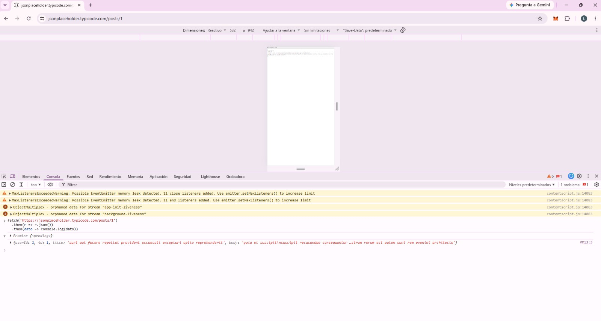
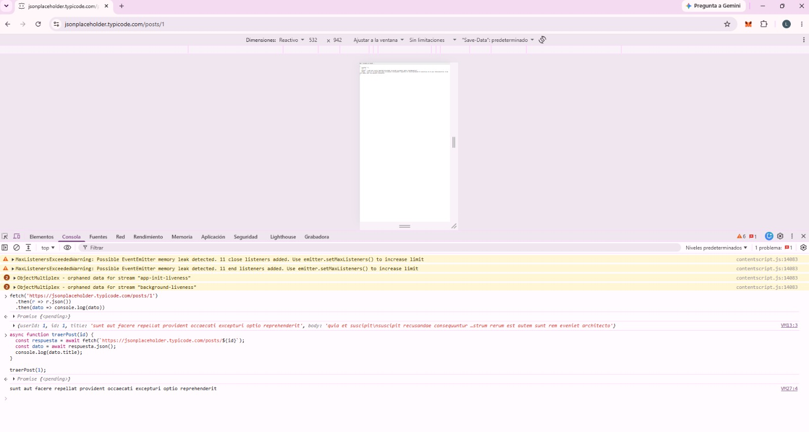
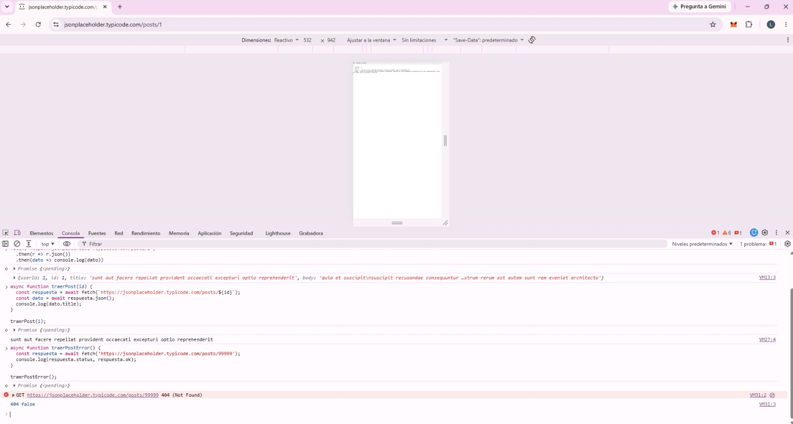
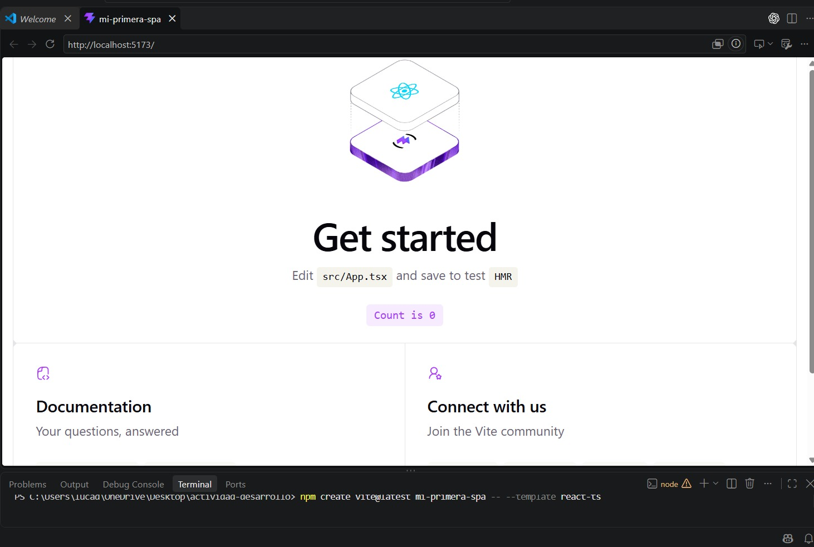
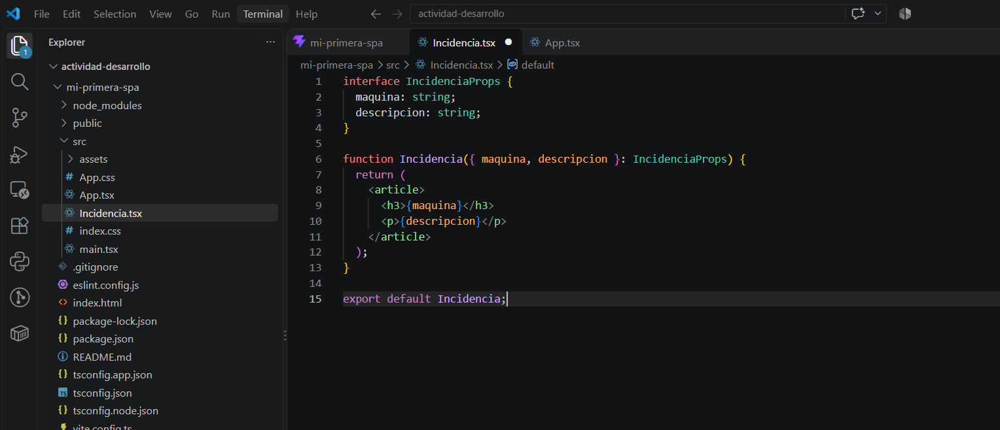
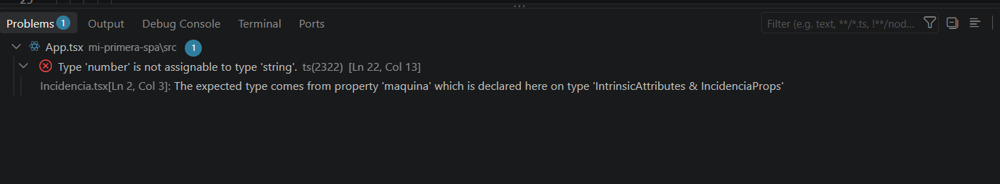
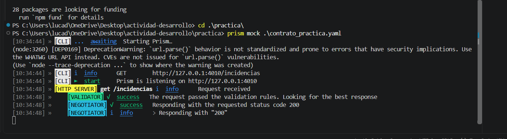
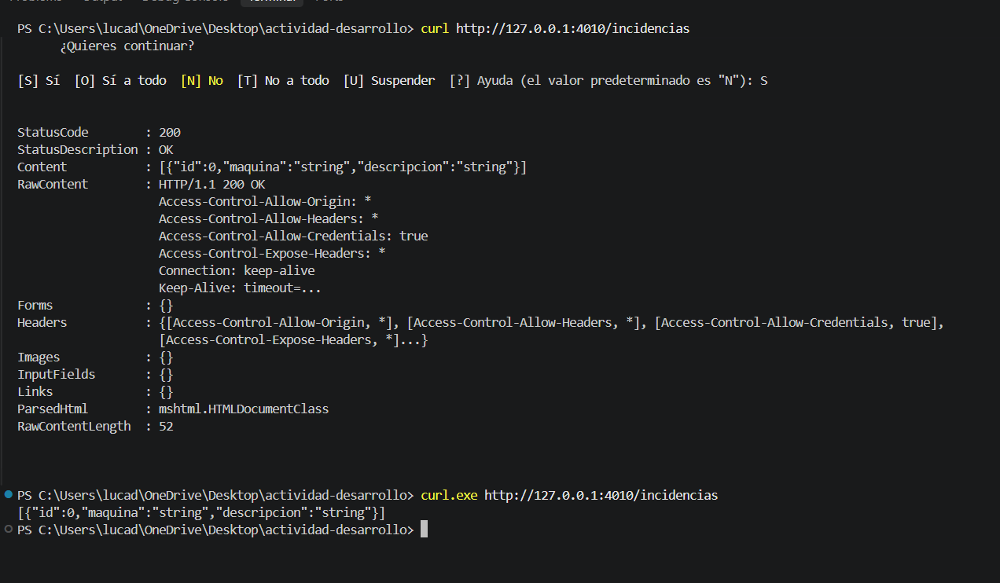

# Investigación — Díaz Guevara, Luca (33716)

## Parte A — JS asincrónico + fetch + SPA

### Búsquedas

#### Búsqueda 1

- Qué busqué: Qué es una SPA y diferencia con una MPA.
- Fuente: https://www.arquitecturajava.com/spa-vs-mpa-y-las-arquitecturas-web/
- Qué entendí: Una SPA carga una aplicación inicialmente y luego actualiza el contenido mediante JavaScript sin recargar toda la página. En una MPA, la navegación normalmente implica cargar una nueva página desde el servidor.

#### Búsqueda 2

- Qué busqué: Qué es una Promise en JavaScript y para qué sirve.
- Fuente: https://es.javascript.info/promise-basics
- Qué entendí: Una Promise es un objeto de JavaScript que conecta el código que realiza una operación que puede tardar con el código que necesita su resultado. Cuando la operación termina, la promesa permite obtener ese resultado y continuar trabajando con él.

#### Búsqueda 3

- Qué busqué: Por qué `fetch` devuelve una promesa y no el dato directamente.
- Fuente: https://developer.mozilla.org/es/docs/Web/API/Fetch_API/Using_Fetch
- Qué entendí: `fetch` devuelve una Promise porque una petición por red puede tardar en completarse. Como la respuesta no está disponible de forma inmediata, la Promise representa ese resultado futuro y permite trabajar con él cuando llega.

#### Búsqueda 4

- Qué busqué: Qué diferencia hay entre `XMLHttpRequest` y `fetch`.
- Fuente: https://developer.mozilla.org/es/docs/Web/API/Fetch_API/Using_Fetch
- Qué entendí: `XMLHttpRequest` es una forma más antigua de hacer peticiones HTTP desde JavaScript. `fetch` es una alternativa más moderna y simple, trabaja con Promises y hace más clara la lectura y el manejo de las respuestas.

### Actividad guiada

Primero probé la API pública JSONPlaceholder accediendo a `/posts`, que devuelve una colección de publicaciones, y a `/posts/1`, que devuelve una publicación particular.

Luego ejecuté un `fetch` desde la consola:

```js
fetch('https://jsonplaceholder.typicode.com/posts/1')
  .then(r => r.json())
  .then(dato => console.log(dato))
```

El resultado mostró primero una Promise pendiente y luego el objeto recibido, con los campos `userId`, `id`, `title` y `body`.

Después realicé la misma petición utilizando `async/await`:

```js
async function traerPost(id) {
  const respuesta = await fetch(`https://jsonplaceholder.typicode.com/posts/${id}`);
  const dato = await respuesta.json();
  console.log(dato.title);
}

traerPost(1);
```

En este caso se mostró en consola el título del post solicitado.

Finalmente probé una petición a un recurso inexistente:

```js
async function traerPostError() {
  const respuesta = await fetch('https://jsonplaceholder.typicode.com/posts/99999');
  console.log(respuesta.status, respuesta.ok);
}

traerPostError();
```

El resultado fue:

`404 false`

Esto permitió comprobar que un error HTTP 404 no hace que `fetch` rechace automáticamente la Promise, sino que es necesario revisar el valor de `respuesta.ok`.

### Evidencia







### Preguntas guía

#### 1. ¿Qué significa que `fetch` sea asincrónico? ¿Qué pasaría con la página si no lo fuera?

Que `fetch` sea asincrónico significa que puede realizar una petición por red sin detener la ejecución del resto del código mientras espera la respuesta. Si no fuera asincrónico, la aplicación tendría que esperar a que termine la petición antes de continuar, lo que podría bloquear la página mientras llega la respuesta.

Fuente: https://developer.mozilla.org/es/docs/Web/API/Fetch_API/Using_Fetch

#### 2. ¿Por qué `respuesta.json()` también devuelve una promesa?

Porque leer y convertir el cuerpo de la respuesta a JSON también es una operación asincrónica. El método `response.json()` necesita terminar de leer el contenido de la respuesta y procesarlo antes de poder devolver el objeto JavaScript, por eso devuelve una Promise que se resuelve cuando ese proceso termina.

Fuente: https://developer.mozilla.org/en-US/docs/Web/API/Response/json

#### 3. ¿Qué relación hay entre una SPA y `fetch`? ¿Por qué la SPA "necesita" pedir datos así?

Una SPA carga una sola página y luego actualiza su contenido con JavaScript sin recargar todo el sitio. Para poder mostrar información nueva necesita pedir datos al servidor de forma asincrónica, y `fetch` permite hacer esas peticiones sin interrumpir la navegación ni recargar la página completa.

Fuente: https://www.arquitecturajava.com/spa-vs-mpa-y-las-arquitecturas-web/


## Parte B — React + TypeScript + Vite

### Búsquedas

#### Búsqueda 1

- Qué busqué: Qué es un componente en React y por qué conviene dividir la interfaz en componentes.
- Fuente: https://es.react.dev/learn
- Qué entendí: Un componente es una parte reutilizable de la interfaz que contiene su propia estructura y comportamiento. Dividir una aplicación en componentes permite organizar mejor el código, reutilizar partes de la interfaz y hacer más sencillo su mantenimiento.

#### Búsqueda 2

- Qué busqué: Qué es JSX y por qué se parece a HTML pero no es HTML.
- Fuente: https://es.react.dev/learn
- Qué entendí: JSX es una extensión de sintaxis de JavaScript que permite escribir una estructura parecida a HTML dentro de los componentes de React. Se parece a HTML, pero no es lo mismo porque tiene reglas propias y luego se transforma a JavaScript.

#### Búsqueda 3

- Qué busqué: Qué es el estado (`useState`) y en qué se diferencia de una variable común.
- Fuente: https://react.dev/learn/state-a-components-memory
- Qué entendí: El estado es la memoria de un componente y permite conservar datos entre renderizados. A diferencia de una variable común, cuando se actualiza el estado con `useState`, React guarda el nuevo valor y vuelve a renderizar el componente para reflejar el cambio en la interfaz.

#### Búsqueda 4

- Qué busqué: Qué son las props y en qué se diferencian del estado.
- Fuente: https://react.dev/learn/thinking-in-react
- Qué entendí: Las props son datos que un componente recibe desde otro componente, normalmente desde su padre. El estado, en cambio, es información propia del componente que puede cambiar durante la interacción y que React conserva entre renderizados.

#### Búsqueda 5

- Qué busqué: Por qué usar TypeScript en el frontend y qué problema resuelve antes de que el código corra.
- Fuente: https://www.typescriptlang.org/docs/handbook/typescript-in-5-minutes.html
- Qué entendí: TypeScript agrega un sistema de tipos a JavaScript que permite detectar ciertos errores antes de ejecutar el programa. Esto ayuda a encontrar problemas, como usar un tipo de dato incorrecto, mientras se está desarrollando y reduce la posibilidad de que esos errores lleguen a producción.

### Actividad guiada

Verifiqué primero la versión de Node.js instalada en mi computadora:

`v24.14.1`

Luego creé una aplicación con React, TypeScript y Vite y levanté el servidor de desarrollo en:

`http://localhost:5173`

Abrí `src/App.tsx` e identifiqué el componente `App` y el JSX que devuelve mediante su `return`.

También modifiqué el título de la aplicación y comprobé que Vite actualizó automáticamente la página sin necesidad de recargar el navegador.

Después creé el componente `Incidencia.tsx`:

```tsx
interface IncidenciaProps {
  maquina: string;
  descripcion: string;
}

function Incidencia({ maquina, descripcion }: IncidenciaProps) {
  return (
    <article>
      <h3>{maquina}</h3>
      <p>{descripcion}</p>
    </article>
  );
}

export default Incidencia;
```

Lo importé en `App.tsx` y mostré tres incidencias utilizando datos simulados.

También probé el estado mediante `useState` utilizando el contador que incluía el proyecto generado por Vite. Al presionar el botón, el valor del contador se actualizaba y React volvía a renderizar la interfaz.

Finalmente provoqué intencionalmente un error de tipos pasando un número donde la prop `maquina` esperaba un `string`. TypeScript detectó el problema y mostró:

`Type 'number' is not assignable to type 'string'`

### Evidencia







### Preguntas guía

#### 1. ¿Qué relación ves entre el patrón "separar datos de la vista" que usaste en el taller de incidencia y el estado de React?

La relación es que los datos se mantienen separados de la forma en que se muestran en pantalla. En React, el estado representa datos que pueden cambiar y, cuando ese estado cambia, React actualiza la vista automáticamente. De esta manera no es necesario modificar manualmente el HTML cada vez que cambia un dato.

#### 2. ¿Por qué el `interface IncidenciaProps` evita errores? ¿Dónde "vive" esa verificación: en el navegador o en el editor?

`IncidenciaProps` define qué datos debe recibir el componente y de qué tipo deben ser. Por ejemplo, definimos que `maquina` debe ser un `string`, por eso cuando le pasamos un número TypeScript mostró el error `Type 'number' is not assignable to type 'string'`.

La verificación se realiza durante el desarrollo, mediante TypeScript y las herramientas del editor/compilador, antes de que el código llegue a ejecutarse normalmente en el navegador.

#### 3. ¿Qué hace Vite que antes hacías a mano (o con un `script` de `<head>`)?

Vite crea y configura la estructura inicial del proyecto y levanta un servidor de desarrollo. También procesa los archivos de React y TypeScript y actualiza automáticamente la aplicación cuando guardamos cambios, sin tener que recargar la página manualmente. Antes, en una página HTML simple, vinculábamos los archivos JavaScript mediante etiquetas `<script>` y manejábamos esa estructura de forma manual.


## Parte C — Contrato OpenAPI + Prism

### Búsquedas

#### Búsqueda 1

- Qué busqué: Qué es un contrato de API y por qué conviene definirlo antes de codificar.
- Fuente: https://learn.openapis.org/specification
- Qué entendí: Un contrato de API describe cómo se comunica una API: qué endpoints tiene, qué métodos usa, qué datos recibe y qué respuestas devuelve. Definirlo antes de programar permite que frontend y backend trabajen sobre la misma estructura y evita que cada parte suponga formatos o comportamientos distintos.

#### Búsqueda 2

- Qué busqué: Qué es un mock server y para qué sirve cuando frontend y backend se desarrollan en paralelo.
- Fuente: https://docs.stoplight.io/docs/prism
- Qué entendí: Un mock server es un servidor falso que simula las respuestas de una API a partir de su contrato. Permite que el frontend haga peticiones y pruebe su funcionamiento aunque el backend real todavía no esté desarrollado.

#### Búsqueda 3

- Qué busqué: Si OpenAPI y Swagger son lo mismo y cuál es la relación entre ambos.
- Fuente: https://swagger.io/docs/specification/basic-structure/
- Qué entendí: OpenAPI es la especificación que define cómo describir una API. Swagger, en cambio, es un conjunto de herramientas que trabajan con esa especificación. El nombre Swagger también se usaba anteriormente para referirse a la especificación, que luego pasó a llamarse OpenAPI.

#### Búsqueda 4

- Qué busqué: Qué es `$ref` en un documento OpenAPI y para qué sirve.
- Fuente: https://learn.openapis.org/specification/components.html
- Qué entendí: `$ref` permite hacer referencia a una definición reutilizable que se encuentra en otra parte del documento, por ejemplo un esquema dentro de `components`. Sirve para evitar repetir la misma estructura varias veces y facilitar el mantenimiento del contrato.

### Actividad guiada

El archivo `contrato_ejemplo_openapi.yaml` mencionado en la consigna no estaba disponible en el repositorio y no pude acceder al Campus en ese momento, por lo que realicé la práctica utilizando un contrato OpenAPI mínimo creado para la actividad.

El contrato utilizado contenía un endpoint `/incidencias` y un esquema reutilizable `Incidencia`.

Instalé Prism con:

```bash
npm install -g @stoplight/prism-cli
```

Luego levanté el mock server utilizando:

```bash
prism mock contrato_practica.yaml
```

Prism quedó escuchando en:

`http://127.0.0.1:4010`

Después realicé una petición:

```bash
curl.exe http://127.0.0.1:4010/incidencias
```

Prism respondió con estado `200 OK` y el siguiente JSON simulado:

```json
[{"id":0,"maquina":"string","descripcion":"string"}]
```

Esto permitió comprobar que Prism puede generar respuestas falsas a partir de un contrato OpenAPI sin que exista todavía un backend real.

### Evidencia





### Preguntas guía

#### 1. ¿Por qué conviene definir el contrato antes de codificar frontend y backend? ¿Qué desastre evita?

Conviene definir primero el contrato porque establece de antemano cómo se van a comunicar el frontend y el backend: qué endpoints existen, qué datos reciben y qué respuestas devuelven. Así ambos pueden desarrollar usando la misma definición.

Esto evita que cada parte haga suposiciones diferentes, por ejemplo que el frontend espere un campo con un nombre o formato distinto al que finalmente devuelve el backend, generando problemas al momento de integrarlos.

Fuente: https://learn.openapis.org/best-practices.html

#### 2. ¿Cómo ayuda un mock server a que dos personas, una en frontend y otra en backend, trabajen en paralelo?

Un mock server simula la API utilizando el contrato aunque el backend real todavía no exista. De esta forma, la persona que desarrolla el frontend puede empezar a hacer peticiones y trabajar con respuestas que respetan el contrato, mientras otra persona desarrolla el backend real.

Cuando el backend esté terminado, ambos deberían respetar el mismo contrato, por lo que la integración debería ser más sencilla.

Fuente: https://learn.openapis.org/

#### 3. ¿Qué relación hay entre el contrato OpenAPI y las reglas de negocio (`RN-STOCK`, `RN-UMBRAL`) que ya documentaste en la M1?

Las reglas de negocio definen cómo debe comportarse internamente el sistema, mientras que el contrato OpenAPI define cómo otros componentes se comunican con ese sistema.

Por ejemplo, una regla de stock puede determinar que una operación no se pueda realizar si no hay stock suficiente. El contrato puede reflejar esa situación indicando qué datos recibe la operación y qué respuesta puede devolver ante ese resultado.

Por lo tanto, el contrato no reemplaza las reglas de negocio, pero debe ser coherente con ellas para que el frontend conozca qué puede enviar y qué respuestas puede recibir del backend.

Fuente: https://learn.openapis.org/specification/paths.html


## Reflexión

Lo que más me costó fue entender cómo se relacionaban conceptos nuevos como Promises, React, TypeScript y OpenAPI con lo que ya habíamos trabajado. Hacer las pruebas prácticas me ayudó a entender mejor cada concepto. También tuve algunos problemas al ejecutar `fetch` y al levantar el mock con Prism, que pude destrabar revisando los errores y probando paso a paso.